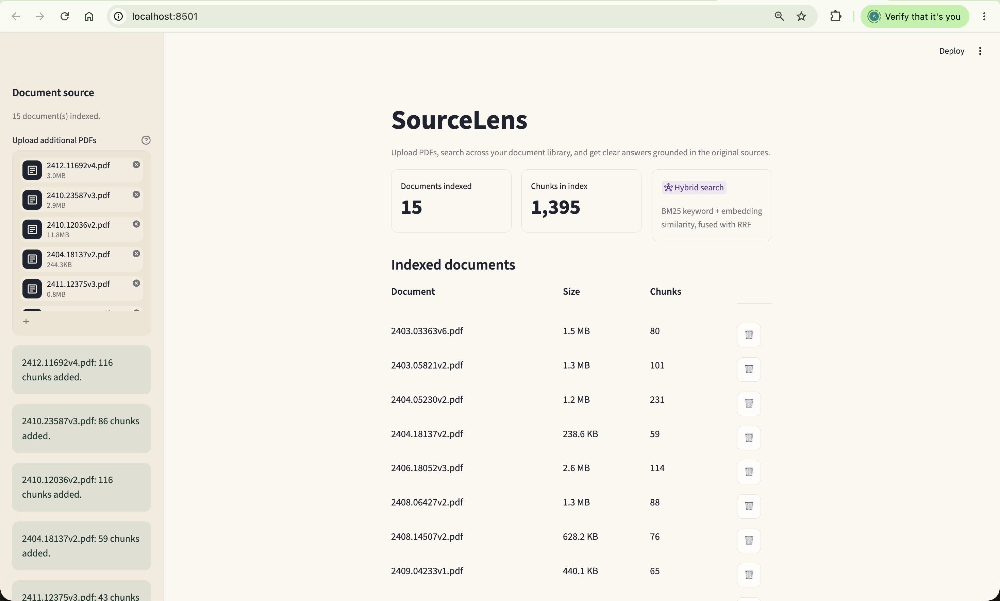
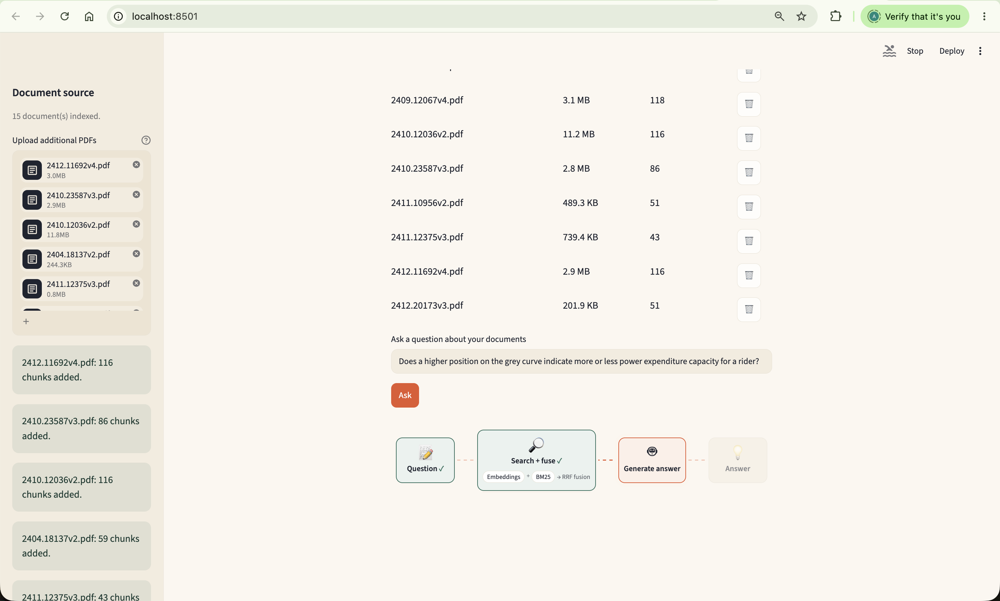
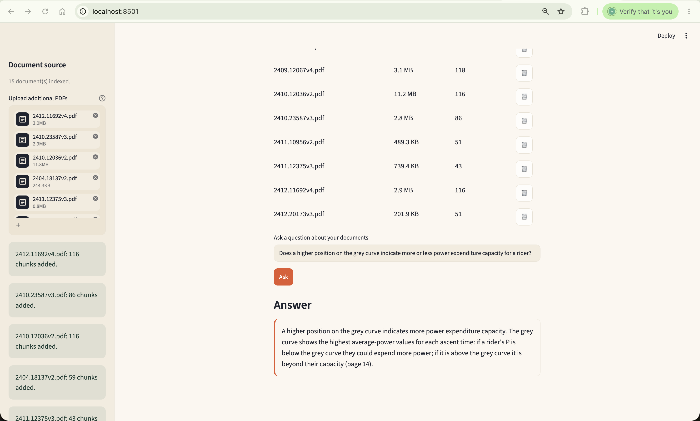

# SourceLens

A Retrieval-Augmented Generation (RAG) application that answers questions grounded in PDFs you
upload. Upload PDFs, search across your document library, and get clear answers generated only
from the content of the document(s), with page references.

## How it works

- Loads and cleans each uploaded PDF
- Splits text into overlapping chunks
- Creates local Hugging Face embeddings
- Stores embeddings persistently in Chroma — documents stay indexed across app restarts until you
  delete them
- Retrieves candidates via **hybrid search**: embedding similarity (Chroma) and keyword search
  (BM25), combined with Reciprocal Rank Fusion (RRF)
- Filters weak matches — a chunk survives if either channel independently qualifies it (embedding
  distance under the threshold, or a positive BM25 keyword-overlap score)
- Reranks the surviving candidates with a local cross-encoder, then keeps the top-ranked results
  (`TOP_K` in `config.py`)
- Generates grounded answers using an OpenAI model

If no chunk clears that bar, the OpenAI API is never called — the app says it couldn't find
relevant information instead of guessing.

## Structure

The pipeline is split into single-responsibility modules, each mirroring one stage above:

- `config.py` — constants (paths, model names, chunk size/overlap, top-k, distance threshold)
- `loader.py` — PDF loading and text cleaning
- `splitter.py` — chunking
- `embedder.py` — local embedding model
- `vector_store.py` — Chroma storage, dedup, per-document listing, and deletion
- `bm25_index.py` — BM25 keyword index, rebuilt from the live vector store on every query
- `fusion.py` — Reciprocal Rank Fusion of the embedding and BM25 result lists
- `retriever.py` — runs both retrieval channels, fuses them, applies threshold filtering, and
  reranks the survivors with a cross-encoder
- `reranker.py` — local cross-encoder reranking model
- `generator.py` — prompt building and OpenAI answer generation
- `streamlit_app.py` — the Streamlit web UI, calling the pipeline modules directly
- `ui_theme.py` — warm editorial theme CSS and the loading-state pipeline animation

## Setup

```bash
python3 -m venv .venv
source .venv/bin/activate
pip install -r requirements.txt
```

Add an `OPENAI_API_KEY` to a `.env` file at the repo root.

## Usage

```bash
streamlit run streamlit_app.py
```

Opens a browser page titled "SourceLens" with a query box and an "Ask" button. The embedding
model, vector store, reranker, and LLM are loaded once per process and reused across questions.

The knowledge base starts empty — there's no bundled document. Upload a PDF from the sidebar to
get started; the "Ask" button and the query box stay disabled (with a prompt to upload a PDF)
until at least one document is indexed.

The main page shows two stat cards (documents indexed, chunks in the index) plus a table of every
indexed document with its size, chunk count, and a Delete button — clicking Delete removes that
document's chunks from the Chroma database entirely, immediately updating the stat cards.

The sidebar lets you upload PDFs — each one is loaded, cleaned, chunked, embedded, and added to
the Chroma vector store, which persists on disk across app restarts and new browser sessions.
Uploading a PDF that's already indexed (by content, not filename) is a no-op — it's detected and
skipped rather than duplicated. Per-file status (chunks added, already indexed, no extractable
text, or a parse error) shows in the sidebar as each upload is processed.

Asking a question replaces the loading spinner with a small animated diagram (Question → Search +
fuse → Generate answer → Answer) that advances in step with what's actually happening — the
"Search + fuse" node lights up while the hybrid retriever runs, and "Generate answer" only lights
up once the LLM call actually starts.

## Screenshots

<!--
  Drop image files into docs/screenshots/ using the filenames below and they'll
  render here automatically — no markup changes needed.
-->

**Home — indexed documents, chunk counts, and stat cards**



**Asking a question — the retrieval/generation pipeline animation**



**The generated answer**



## Notes

- There is no test suite, linter, or build step configured in this repo.
- Every retrieval logs each fused candidate's rank, RRF score, per-channel distance/score, and
  pass/drop verdict to the console (the Streamlit server's terminal) — useful for debugging why a
  question returned no answer or which channel (embedding, BM25, or both) surfaced a given chunk.
  A second log block shows the final cross-encoder reranked order and each score.
- `requirements.txt` includes `deepeval`, used only by the retrieval/generation evaluation script
  under `extract_pdfs_rag/` (`eval.py`) — not needed to run the app itself. The script and its
  benchmark metadata are tracked in git; the underlying PDF binaries and per-run outputs
  (`eval_vector_store/`, `eval_runs/`) are gitignored.
